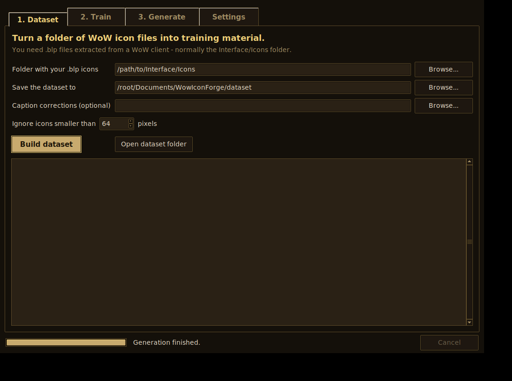

# Getting started

This guide takes you from nothing to generating your own World of
Warcraft-style icons. No command-line experience is assumed — you will type
exactly three lines into a terminal, once, during setup, and everything after
that happens in the app.


## What you'll end up with

1. A **dataset** built from real WoW icon art (your extracted `.blp` files).
2. A **trained style file** (a "LoRA") that teaches Stable Diffusion what a
   WoW icon looks like.
3. **New icons from text prompts** — framed with a gold border and saved as
   PNG, or as BLP ready to drop into the game client.

You can skip straight to step 3 at any time: the Generate tab works in
*preview mode* before anything is trained, so you can learn the app with
placeholder art first.

## Step 0 — Install Python (once)

1. Go to <https://www.python.org/downloads/> and download Python 3.10 or newer.
2. Run the installer. **On Windows, tick "Add python.exe to PATH"** on the
   first screen — it's a checkbox at the bottom, easy to miss.

## Step 1 — Install and launch the app

Open a terminal (on Windows: press the Start key, type `cmd`, press Enter)
and paste these three lines:

```
git clone https://github.com/Kobiesan/Classic-WoW-Icon-Generator
cd Classic-WoW-Icon-Generator
pip install -r requirements.txt
```

*(No git? Use the green **Code → Download ZIP** button on the GitHub page,
unzip it, and `cd` into the folder instead.)*

Then start the app:

```
python -m wowicons.gui
```

That last line is the only one you'll ever need again.

## Step 2 — Build your dataset (tab 1)



You need icon files extracted from a WoW client. They are `.blp` files, and
they live under `Interface\Icons` inside the game's data archives. Any MPQ
extractor (for classic clients) or CASC extractor (for modern ones) can pull
them out — this app reads the `.blp` files themselves, it does not open the
archives.

1. **Folder with your .blp icons** → point it at the folder you extracted.
2. **Save the dataset to** → anywhere with a few hundred MB free. A default
   under your Documents is already filled in.
3. Press **Build dataset**.

A few thousand icons take about a minute. When it finishes, the log shows a
category breakdown (weapons, armor, spells…) so you can see what the model
will be learning from. Lopsided categories mean the style will be stronger for
the common ones — that's normal.

**Fixing captions (optional).** Each image gets a caption guessed from its
filename. If some are wrong, edit `overrides.json` in this folder — it's a
plain text file with instructions inside — pick it in the *Caption
corrections* box, and rebuild. Rebuilding is fast.

## Step 3 — Train your style (tab 2)

This is the one step that needs real hardware: an NVIDIA graphics card with
6 GB of memory or more, and a few hours.

One-time setup, in this order:

1. **PyTorch** — go to <https://pytorch.org/get-started/locally/>, pick your
   system and CUDA version, and run the command it shows you.
2. **sd-scripts** (the trainer) — download it from
   <https://github.com/kohya-ss/sd-scripts> (Code → Download ZIP), unzip it
   anywhere, and follow its short install section.
3. In the app: point **sd-scripts folder** at that unzipped folder.

Press **Check what's needed** at any point — it lists exactly what's missing
and how to fix each item, in plain language.

Then press **Start training**. The dataset folder is filled in automatically
from step 2. Training streams its progress into the log; you can leave it
running and come back. The defaults (10 passes, batch of 4) are a sensible
starting point.

When it finishes, your style files are in `<your dataset>\model\` — one
`.safetensors` file **per pass**, so if the last one overshoots ("every icon
looks like the same three icons"), just pick an earlier one.

## Step 4 — Generate icons (tab 3)

1. On **Settings**, set *Your trained style file* to a `.safetensors` from
   step 3, and install the generation libraries if you haven't:

   ```
   pip install diffusers transformers accelerate safetensors
   ```

2. Back on **Generate**: describe the icon. Prompts work best in the same
   shape as the training captions — a category, then details:

   > `weapon, sword, glowing blue runes`
   > `consumable, potion, swirling green liquid`
   > `fire spell, phoenix rising`

   The style keyword (`wowicon`) is added for you automatically.

3. Press **Generate icons**. Each result shows at 4× zoom with:
   - **PNG** — save for mockups, mods, or the web,
   - **BLP** — save in the game's own format, mipmaps and all,
   - **Again** — re-run just that one, same seed, after you tweak the prompt.

**About seeds:** the same seed + prompt always gives the same image. Keep the
seed fixed while you refine wording; press **Randomize** when you want fresh
variations.

**About borders:** icons are framed with a built-in gold border. To use your
own frame, point *Border template* in Settings at any 64×64 PNG whose middle
is transparent — the art shows through the transparent part, the corners stay
transparent, exactly like the game's own icons.

## When something goes wrong

| What you see | What it means |
| --- | --- |
| "Preview mode" under the Generate button | PyTorch/diffusers aren't installed, or no style file is selected in Settings. The button still works — it just draws placeholders. |
| "sd-scripts was not found" | The *sd-scripts folder* box isn't pointing at the unzipped sd-scripts download. It's the folder containing `train_network.py`. |
| "No icons were converted" | The folder you picked has no `.blp` files in it (or only tiny ones). Check you extracted `Interface\Icons`, not the archive itself. |
| Training stops with "CUDA out of memory" | Your card ran out of room. Lower *Images at a time* to 2 or 1 on the Train tab. |
| Training icons look like exact copies from the game | Overtrained. Use an earlier `.safetensors` from the `model` folder. |
| The window won't open on Linux | Install tkinter: `sudo apt install python3-tk`, then relaunch. |

Every error in the app is also written to the log panel on the tab it happened
on, with the full details underneath the short message.

## One rule of thumb

Anything the app does can also be done from the command line — see the
[README](README.md) — and both do exactly the same thing underneath. Start
with the app; graduate to the command line only if you want to script it.
