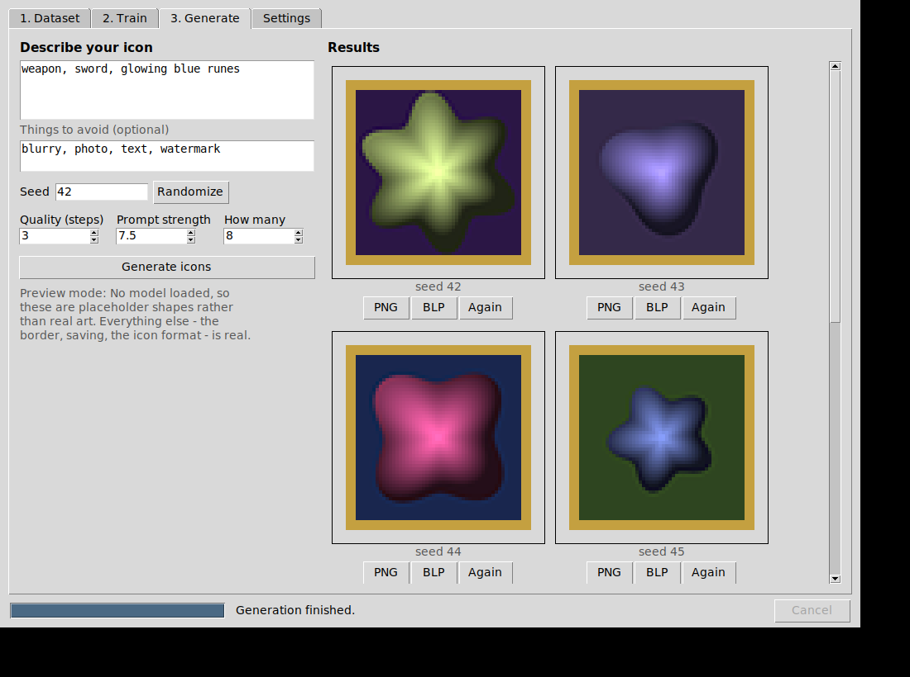

# Classic WoW Icon Generator

Generate World of Warcraft-style icons: build a training dataset from real WoW
icon art, train a LoRA on it, then make new icons from text prompts.

## Start here: the app

```bash
pip install -r requirements.txt
python -m wowicons.gui
```

One window, three numbered tabs in the order you use them.



| Tab | What it does | What you need |
| --- | --- | --- |
| **1. Dataset** | Turns a folder of `.blp` icons into training material | `.blp` files extracted from a WoW client |
| **2. Train** | Teaches a model your icon style | A graphics card, plus [sd-scripts](https://github.com/kohya-ss/sd-scripts) |
| **3. Generate** | Makes new icons from a prompt, borders and all | Nothing to start - see below |

Nothing needs a terminal after the first line. Every long job runs in the
background with a progress bar and a Cancel button, every error is a sentence
rather than a stack trace, and the folders you pick are remembered.

**The Generate tab works immediately**, before you have trained anything. With
no model installed it runs in *preview mode*: the shapes are placeholders, but
the border compositing, the 4x pixel-crisp previews, and PNG/BLP saving are all
real. That is enough to set up your border template and check the pipeline end
to end. Install PyTorch and diffusers, point Settings at a trained
`.safetensors`, and the same button produces real art.

### Making generation real

```bash
# 1. PyTorch, matched to your graphics card - pick the command at:
#    https://pytorch.org/get-started/locally/
# 2. then:
pip install ".[generate]"
```

Then on the Settings tab, choose the `.safetensors` file that training produced.
The Train tab writes it to `<your dataset>/model/`.

No ONNX export step is needed: the LoRA loads straight onto a base checkpoint.

## Command line

Everything the app does is also scriptable.

```bash
python -m wowicons --input /path/to/Interface/Icons --output ./dataset \
                   --overrides overrides.json

python -m wowicons.prompts --manifest dataset/manifest.csv \
                           --output training/sample_prompts.txt

SD_SCRIPTS=~/src/sd-scripts ./training/train_lora.sh
```

## What it does

1. **Decodes BLP** with a pure-Python decoder (`wowicons/blp.py`) — BLP1 and
   BLP2, palettized (1/4/8-bit alpha), DXT1/DXT3/DXT5, and BGRA8888. No
   external binaries, no `BLPConverter.exe`.
2. **Upscales** each icon to 512×512 with Lanczos and writes it as PNG. The
   alpha channel is composited onto black *before* resizing, so transparent
   borders don't bleed a dark halo into the art, and the result is plain RGB
   the way trainers expect it.
3. **Captions** each image by parsing the filename, then applies
   `overrides.json` on top.
4. **Writes `manifest.csv`** and prints category counts so class imbalance is
   visible before you spend GPU hours on it.

### Output layout

```
dataset/
├── img/
│   └── 10_wowicon icon/          <repeats>_<instance token> <class token>
│       ├── INV_Sword_04.png      512x512 RGB
│       ├── INV_Sword_04.txt      "wowicon, weapon, sword"
│       └── ...
├── model/
├── log/
└── manifest.csv                  source_path, output_path, caption, category
```

Point kohya_ss at `dataset/` (or directly at `dataset/img`) and it will pick up
the repeat count from the folder name.

## Captions

Captions are always `wowicon, <category>, <subject terms>`:

| Filename | Caption |
| --- | --- |
| `INV_Sword_04.blp` | `wowicon, weapon, sword` |
| `INV_Chest_Cloth_17.blp` | `wowicon, armor, chest, cloth` |
| `Spell_Fire_Fireball02.blp` | `wowicon, fire spell, fireball` |
| `Spell_Holy_PowerWordShield.blp` | `wowicon, holy spell, power word shield` |
| `Ability_Warrior_Charge.blp` | `wowicon, warrior ability, charge` |
| `Trade_Alchemy.blp` | `wowicon, profession, alchemy` |
| `Achievement_BG_winWSG.blp` | `wowicon, achievement, battleground, win wsg` |

The parse, in order:

1. Strip the extension and split on `_` (also `-` and spaces).
2. Split each token on CamelCase boundaries, keeping acronyms whole
   (`PowerWordShield` → `power word shield`, `winWSG` → `win wsg`).
3. Drop purely numeric words, which removes both `_04` and the counter glued
   onto `Fireball02`.
4. Choose a category from the `INV_` / `Spell_` / `Ability_` / `Trade_` /
   `Achievement_` prefix, refined by the words after it — `INV_` splits into
   `weapon`, `armor`, `jewelry`, `consumable`, `reagent`, `container`,
   `ammunition`, `document`, `currency`, `banner`, `gadget` or `misc item`;
   `Spell_` becomes `<school> spell`; `Ability_` becomes `<class> ability`.
   The tables live at the top of `wowicons/captions.py` and are meant to be
   edited.
5. Drop words the category already implies, so captions don't stutter
   (`Spell_Fire_Fireball02` gives `fire spell, fireball`, not
   `fire spell, fire, fireball`).

One underscore-separated token becomes one comma-separated caption term, which
keeps multi-word names like `power word shield` intact instead of shredding
them into unrelated tags.

## overrides.json

Hand-editable corrections applied *after* the automatic parse. Keys are
case-insensitive `fnmatch` patterns tested against the filename with and
without its extension; rules apply top to bottom, so later ones win.

```jsonc
{
  "_comment": "keys starting with _ are ignored, so notes are safe to keep",

  "Trade_Engraving*":     { "terms": ["enchanting", "glowing rune"] },
  "INV_Misc_QuestionMark": { "category": "ui", "terms": ["question mark"] },
  "Spell_Fire_*":         { "add_terms": ["flames"] },
  "INV_Enchant_*":        { "drop_terms": ["enchant"] },
  "INV_Sword_*":          "sword, blade"
}
```

| Key | Effect |
| --- | --- |
| `category` | Replace the detected category (also changes the manifest and the counts) |
| `terms` | Replace the subject terms outright |
| `add_terms` | Append terms, skipping duplicates |
| `drop_terms` | Remove terms |

A bare string or list (`"sword, blade"` / `["sword", "blade"]`) is shorthand
for `terms`. If you need explicit ordering, use the list form instead:
`{"rules": [{"match": "INV_*", "add_terms": ["item art"]}]}`.

The `overrides.json` in this repo is a starting point — it fixes a few icons
whose filenames lie (`Trade_Engraving` is the enchanting icon) and adds art
hints to some spell schools.

## CLI

| Flag | Default | Meaning |
| --- | --- | --- |
| `--input` | *required* | Directory of `.blp` files, searched recursively |
| `--output` | *required* | Where to write the training folder |
| `--overrides` | none | Path to `overrides.json` |
| `--min-size` | `64` | Skip source icons whose shorter side is smaller |
| `--size` | `512` | Edge length of the upscaled images |
| `--repeats` | `10` | Repeat count baked into the kohya_ss folder name |
| `--instance-token` | `wowicon` | Trigger word; starts every caption |
| `--class-token` | `icon` | Class word in the kohya_ss folder name |
| `--dry-run` | off | Decode and caption everything, write nothing |

Undecodable files and undersized icons are reported at the end, with counts and
examples, rather than aborting the run.

## Training

Ready-to-run kohya_ss / sd-scripts config lives in [`training/`](training/),
targeting SD 1.5 at 512×512 to match the dataset. Every setting is commented
with the reasoning, and samples render after each epoch so quality is visible
while the run is still going:

```bash
python -m wowicons.prompts --manifest dataset/manifest.csv \
                           --output training/sample_prompts.txt
SD_SCRIPTS=~/src/sd-scripts ./training/train_lora.sh
```

See [`training/README.md`](training/README.md) for the tuning order, what each
failure mode looks like in the epoch samples, VRAM fallbacks, and the SDXL
deltas.

## Module layout

| Module | Responsibility |
| --- | --- |
| `wowicons/blp.py` | BLP1/BLP2 → RGBA. Standard library only, no numpy, no Pillow. |
| `wowicons/captions.py` | Filename → caption, plus overrides loading/applying. |
| `wowicons/pipeline.py` | Walk, decode, upscale, write PNG/TXT, manifest, counts. |
| `wowicons/cli.py` | argparse front end. |
| `wowicons/prompts.py` | `manifest.csv` → `sample_prompts.txt` for per-epoch previews. |
| `wowicons/compositing.py` | Content mask, Lanczos downscale, unsharp, border compositing. |
| `wowicons/blp_writer.py` | BLP2 writer: palettized, 8-bit alpha, full mip chain. |
| `wowicons/generate.py` | Generation backends: preview stub and Stable Diffusion. |
| `wowicons/gui/` | The desktop app. `jobs`, `environment` and `workflows` are display-free. |

`blp.py` is deliberately isolated for the planned C# port: it has no
third-party imports at module level (a test enforces this), keeps the header
layouts documented in its docstring, and uses plain integer arithmetic over
byte arrays. The single exception is the rare JPEG-compressed BLP1 variant,
which lazily imports Pillow for the embedded JPEG stream — a C# port would use
its own image library there and can lift the rest as-is.

## Tests

```bash
python -m pytest
```

321 tests. The window itself is exercised under a virtual display, so the
results grid, validation messages and a full generate-and-render cycle are
covered rather than assumed; on an interpreter without tkinter those tests skip
and the other 283 still run.

The suite covers the parser against real `Interface/Icons` filenames, override
handling, the decoder against synthesized BLP1/BLP2 payloads for every
supported encoding (built in `tests/blp_builders.py`, so no binary fixtures or
client files are committed), and an end-to-end run of the pipeline and CLI.
